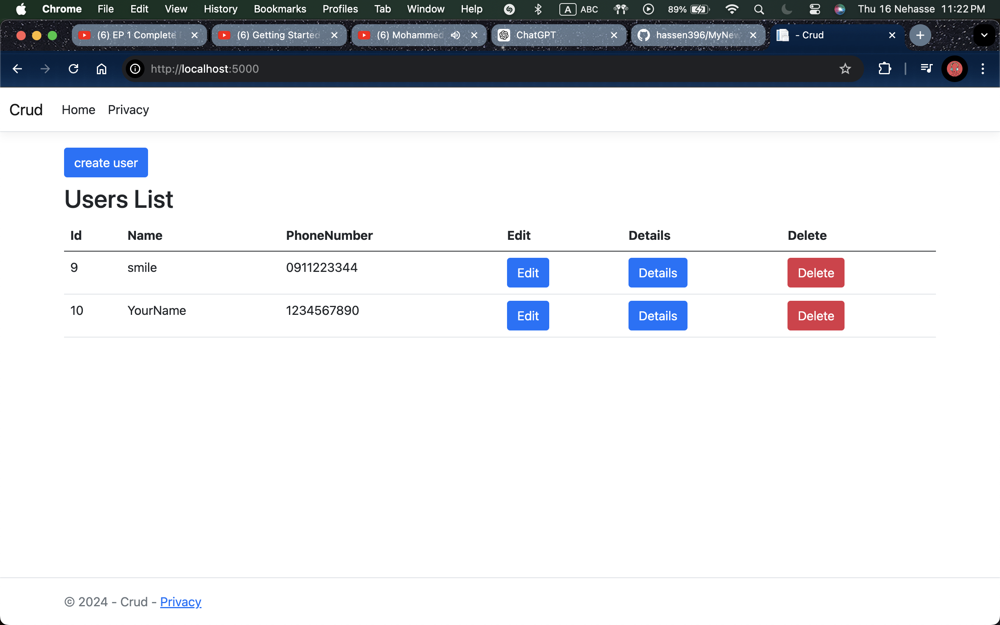
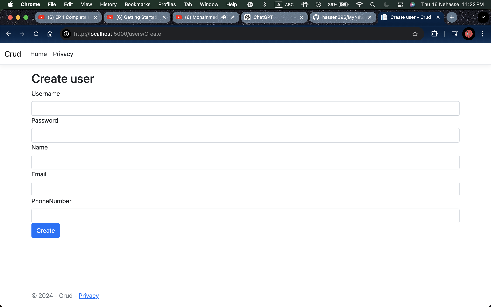
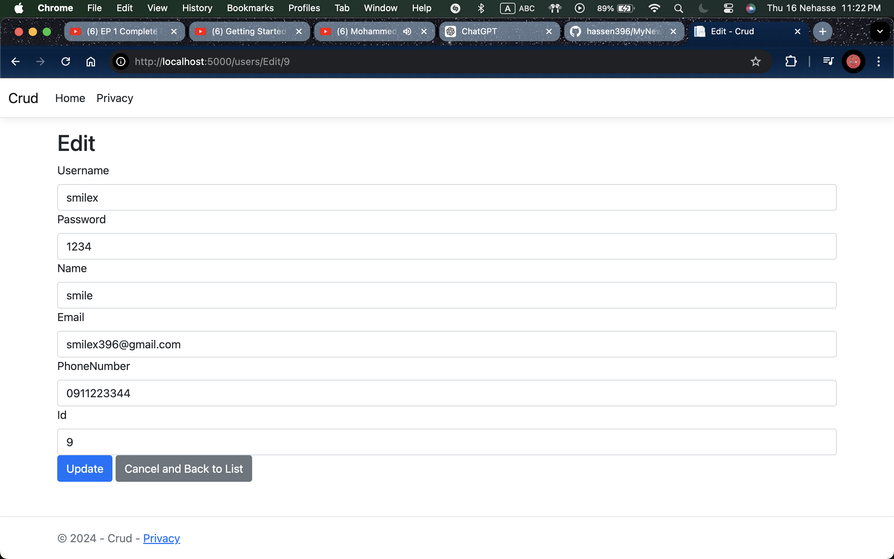

# CRUD Application with ASP.NET Core

This project is a basic CRUD (Create, Read, Update, Delete) web application built with ASP.NET Core and Entity Framework Core. It allows managing user data through a simple interface.

## Features

- **List Users**: Display all users in the database.
- **Add User**: Create and add a new user.
- **Edit User**: Modify details of an existing user.
- **View User Details**: See specific details of a user.
- **Delete User**: Remove a user from the database.

## Screenshots
<div style="text-align: center;">
    <h3>1. User List</h3>
    
</div>

<div style="text-align: center;">
    <h3>2. Create User</h3>
    
</div>

<div style="text-align: center;">
    <h3>3. Edit User</h3>
    
</div>

## Getting Started

### Prerequisites

- [.NET Core SDK](https://dotnet.microsoft.com/download) installed on your machine.
- An IDE like [Visual Studio Code](https://code.visualstudio.com/) or [Visual Studio](https://visualstudio.microsoft.com/).

### Installation

1. Clone the repository:

   ```bash
   git clone https://github.com/your-username/your-repo.git
2. Navigate to the project directory:

    ```bash
    cd your-repo
    ```
3. Install dependencies:

    ```bash
    dotnet restore
    ```
4. Apply the database migrations:
    ```bash
    dotnet ef database update
    ```
5. Run the application:
    ```bash
    dotnet run
    ```
6. Open your browser and go to ```bash http://localhost:5000 ``` to view the application.


```vbnet
This version is more straightforward, focusing on clarity and simplicity. Let me know if there's anything else you'd like to add or adjust!
```

